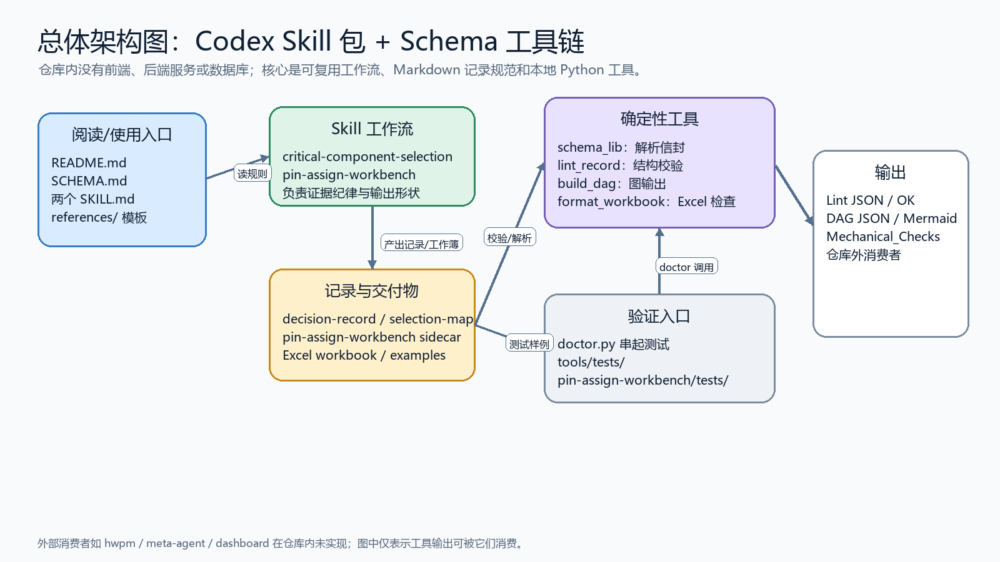
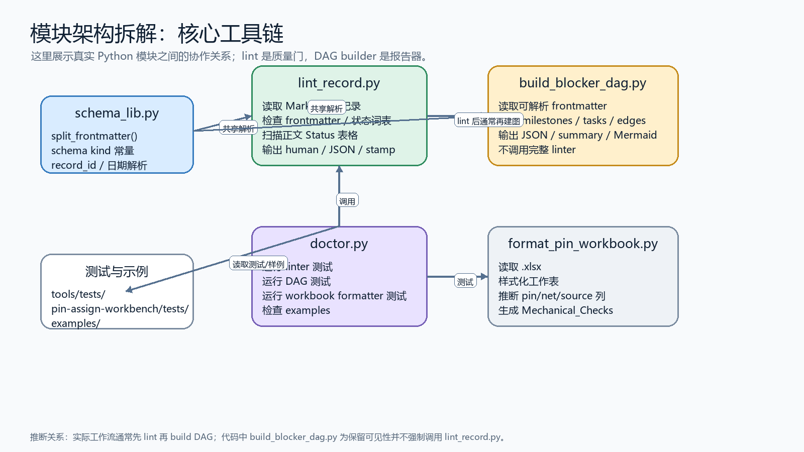
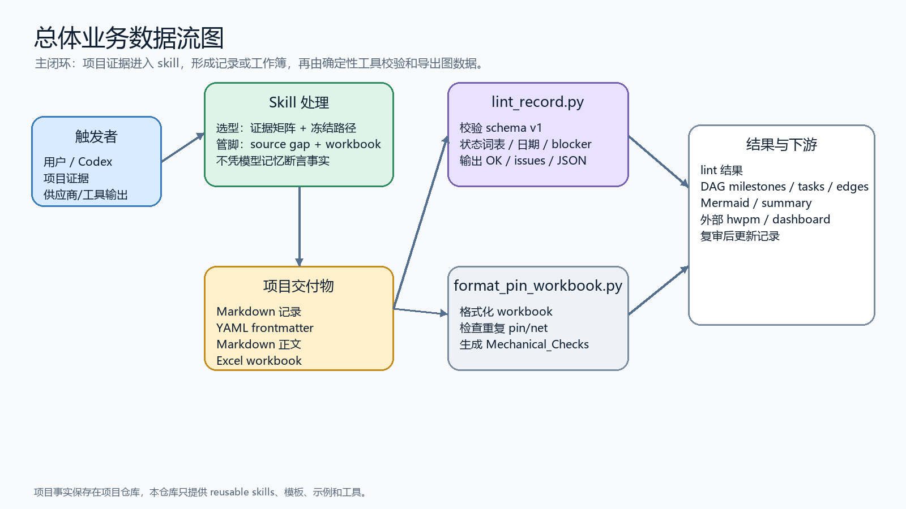
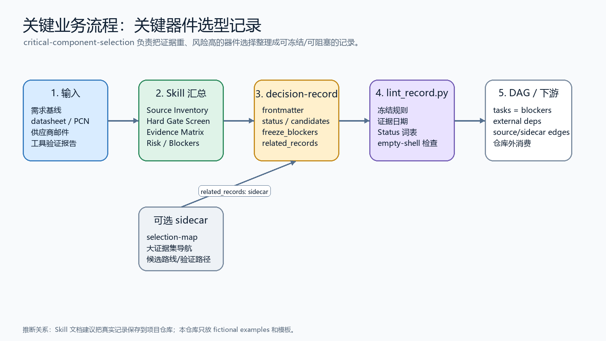
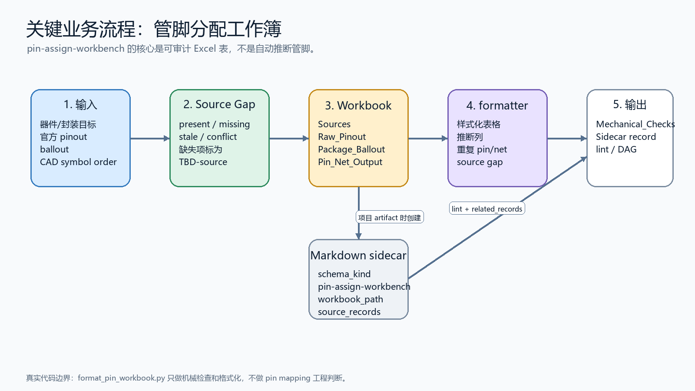
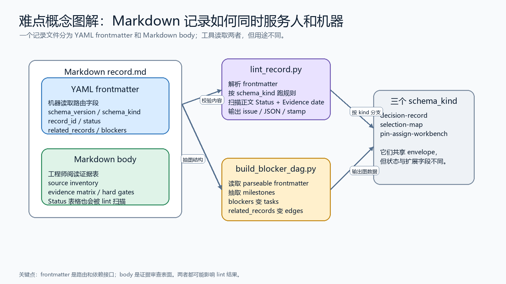

# hardware-codex-skills

`hardware-codex-skills` 是一个面向硬件工程交付的 Codex skill 仓库。它不是前端应用、后端服务或数据库项目，也不保存真实项目资料；它保存的是可复用的工作流说明、Markdown 记录 Schema、模板、示例和本地 Python 工具。

新手可以先记住一句话：这个仓库帮助 Codex 把“证据很重的硬件决策”整理成可审查的 Markdown 记录或 Excel 工作簿，再用确定性脚本检查结构并导出依赖图。

## 项目结构与文件索引

下面只列出理解项目所需的关键文件和目录，已忽略缓存、构建产物和临时文件。

| 路径 | 作用 |
|---|---|
| [README.md](./README.md) | 项目入口文档，帮助第一次接触项目的人理解目录、架构、数据流和核心概念。 |
| [SCHEMA.md](./SCHEMA.md) | 记录格式的主规范，定义 `schema_kind`、frontmatter 字段、状态枚举、lint 规则和 DAG 输出格式。 |
| [requirements-dev.txt](./requirements-dev.txt) | 本地开发和测试依赖，目前主要包含 `pyyaml`、`openpyxl` 和 `pytest`。 |
| [docs/architecture.md](./docs/architecture.md) | 架构说明文档，解释 source of truth、分层、数据流和扩展规则。 |
| [docs/ai-software-engineering-governance.md](./docs/ai-software-engineering-governance.md) | AI 工程治理说明，描述责任、风险、证据、工具权限和审计闭环。 |
| [docs/assets](./docs/assets) | README 和文档使用的架构图、数据流图与概念说明图。 |
| [critical-component-selection/SKILL.md](./critical-component-selection/SKILL.md) | `critical-component-selection` skill 的入口文件，定义关键器件选型的触发边界、证据规则和输出要求。 |
| [critical-component-selection/references](./critical-component-selection/references) | 关键器件选型的模板和操作指南，例如决策记录、证据矩阵、冻结检查和沟通报告。 |
| [critical-component-selection/examples](./critical-component-selection/examples) | 虚构的选型记录示例，用于说明 Schema 形状并参与测试校验。 |
| [critical-component-selection/scripts/lint_decision_record.py](./critical-component-selection/scripts/lint_decision_record.py) | 旧路径兼容入口，实际会转发到仓库级 linter。 |
| [pin-assign-workbench/SKILL.md](./pin-assign-workbench/SKILL.md) | `pin-assign-workbench` skill 的入口文件，定义管脚/网络分配工作簿的证据规则和交付边界。 |
| [pin-assign-workbench/assets/pin-assign-template.xlsx](./pin-assign-workbench/assets/pin-assign-template.xlsx) | 管脚分配工作簿模板，提供 `Sources`、`Raw_Pinout`、`Pin_Net_Output` 等推荐表结构。 |
| [pin-assign-workbench/references](./pin-assign-workbench/references) | 管脚工作簿相关指南，包括 source policy、workbook pattern、schematic output 和 validation checklist。 |
| [pin-assign-workbench/examples](./pin-assign-workbench/examples) | 虚构的管脚工作簿 Markdown sidecar 示例。 |
| [pin-assign-workbench/scripts/format_pin_workbook.py](./pin-assign-workbench/scripts/format_pin_workbook.py) | Excel 工具入口，负责格式化工作簿并生成 `Mechanical_Checks` 检查表。 |
| [pin-assign-workbench/tests/test_format_pin_workbook.py](./pin-assign-workbench/tests/test_format_pin_workbook.py) | 管脚工作簿格式化脚本的关键测试入口。 |
| [tools/scripts/schema_lib.py](./tools/scripts/schema_lib.py) | 共享 Schema 解析模块，负责解析 YAML frontmatter、日期、record id 和 Schema 常量。 |
| [tools/scripts/lint_record.py](./tools/scripts/lint_record.py) | 仓库级记录校验入口，负责校验 frontmatter、状态枚举、正文表格、证据日期和冻结规则。 |
| [tools/scripts/build_blocker_dag.py](./tools/scripts/build_blocker_dag.py) | DAG 构建入口，读取记录 frontmatter 并输出 milestones、freeze blockers、related records 和 supersession edges。 |
| [tools/scripts/doctor.py](./tools/scripts/doctor.py) | 本地总验证入口，串行运行测试、示例记录 lint 和示例 DAG summary。 |
| [tools/tests](./tools/tests) | `lint_record.py` 和 `build_blocker_dag.py` 的核心测试目录。 |

入口怎么找：

- 想理解仓库整体，先读 [README.md](./README.md)，再读 [SCHEMA.md](./SCHEMA.md)。
- 想使用某个工作流，入口是对应的 [critical-component-selection/SKILL.md](./critical-component-selection/SKILL.md) 或 [pin-assign-workbench/SKILL.md](./pin-assign-workbench/SKILL.md)。
- 想运行校验，入口是 [tools/scripts/doctor.py](./tools/scripts/doctor.py)。
- 想单独校验记录，入口是 [tools/scripts/lint_record.py](./tools/scripts/lint_record.py)。
- 想从记录生成依赖图，入口是 [tools/scripts/build_blocker_dag.py](./tools/scripts/build_blocker_dag.py)。
- 想格式化管脚工作簿，入口是 [pin-assign-workbench/scripts/format_pin_workbook.py](./pin-assign-workbench/scripts/format_pin_workbook.py)。

## 总体架构图

这张图展示仓库内真实存在的主要部分：两个 Codex skills、共享 Schema、示例/模板、本地校验工具、DAG 工具和 Excel 格式化工具。仓库内没有前端页面、后端 API、数据库或常驻服务。



## 模块架构拆解

### 核心工具链架构图

这张图聚焦 Python 工具之间的关系。`schema_lib.py` 提供共享解析能力；`lint_record.py` 是质量门；`build_blocker_dag.py` 是图数据报告器；`doctor.py` 串起测试和示例校验。



推断关系：实际使用中通常先运行 `lint_record.py`，再运行 `build_blocker_dag.py`；但从代码看，[build_blocker_dag.py](./tools/scripts/build_blocker_dag.py) 并不会强制调用 [lint_record.py](./tools/scripts/lint_record.py)，这是为了在记录存在 lint 问题时仍保留部分图可见性。

## 总体业务数据流图

这张图展示主业务闭环：用户或 Codex 从项目证据出发，经过 skill 形成 Markdown 记录或 Excel 工作簿，再由本地工具校验、生成检查表或导出 DAG 数据。



## 关键业务流程拆解

### 关键器件选型记录流程

`critical-component-selection` 面向“会影响 schematic、BOM、pin assignment、layout、sourcing 或 validation 的器件决策”。它的主要输出是 `decision-record`，复杂场景可附带 `selection-map`。



推断关系：skill 文档建议真实记录保存到项目仓库，例如 `hardware-projects/prj/<project>/decisions/`；本仓库只保存模板和虚构示例，不包含真实项目记录。

### 管脚分配工作簿流程

`pin-assign-workbench` 面向可审计的 pin/net 分配交付物。真实代码边界很清楚：[format_pin_workbook.py](./pin-assign-workbench/scripts/format_pin_workbook.py) 只做格式化和机械检查，不会自动推断 pin mapping，也不会替工程师做拓扑选择。



## 难点概念图解

### Markdown 记录结构

这个项目最关键的概念是“记录文件同时服务人和机器”：YAML frontmatter 给脚本和下游系统读取，Markdown body 给工程师审查证据与理由。



## 关键概念速览

| 概念 | 新手解释 |
|---|---|
| Skill | Codex 的工作流说明文件。这个仓库目前有 `critical-component-selection` 和 `pin-assign-workbench` 两个主要 skill。 |
| Record | 带 YAML frontmatter 的 Markdown 文件，是这个仓库 Schema 工具处理的核心对象。 |
| Frontmatter | Markdown 文件开头 `---` 包住的 YAML 区域，机器主要读这里来判断类型、状态、依赖和 blockers。 |
| Body | Markdown 正文，工程师主要读这里来审查来源、证据矩阵、风险、冻结理由和交付说明。 |
| `schema_kind` | 记录类型。目前真实支持三种：`decision-record`、`selection-map`、`pin-assign-workbench`。 |
| `decision-record` | 关键器件选型记录，描述候选料号、证据状态、冻结状态和阻塞项。 |
| `selection-map` | 大型选型的 sidecar，用来导航大量来源、候选路线、证据缺口和验证路径。 |
| `pin-assign-workbench` | 管脚分配工作簿的 Markdown sidecar，用来让 Schema 工具追踪 workbook 路径和来源记录。 |
| `freeze_blockers` | 阻止 `decision-record` 进入 `frozen` 状态的具体事项，会被 DAG 工具抽取成 tasks。 |
| `related_records` | 记录之间的图关系，例如 `source`、`derived`、`sidecar` 和 `superseded`。 |
| Lint | 结构校验，不是工程事实验证。它能发现字段缺失、状态词错误、证据日期缺失、冻结规则不一致等问题。 |
| DAG | 由记录关系和 blockers 组成的图数据，供仓库外的项目管理或 dashboard 工具消费。 |

## 当前支持的记录类型

| `schema_kind` | 由谁产生 | 主要用途 |
|---|---|---|
| `decision-record` | [critical-component-selection/SKILL.md](./critical-component-selection/SKILL.md) | 记录关键器件选型、候选项、证据状态、冻结阻塞项和外部验证需求。 |
| `selection-map` | [critical-component-selection/SKILL.md](./critical-component-selection/SKILL.md) | 作为复杂选型的导航 sidecar，帮助后续 agent 或工程师继续处理大量证据。 |
| `pin-assign-workbench` | [pin-assign-workbench/SKILL.md](./pin-assign-workbench/SKILL.md) | 作为 Excel 管脚分配工作簿的 Markdown sidecar，提供路径、来源记录和状态信息。 |

## 核心命令

安装开发依赖：

```bash
pip install -r requirements-dev.txt
```

运行完整本地验证：

```bash
python tools/scripts/doctor.py
```

校验一个或多个记录：

```bash
python tools/scripts/lint_record.py path/to/record.md
python tools/scripts/lint_record.py path/to/records/ --strict
python tools/scripts/lint_record.py path/to/records/ --format json
```

生成 DAG 数据：

```bash
python tools/scripts/build_blocker_dag.py path/to/records/ --format summary
python tools/scripts/build_blocker_dag.py path/to/records/ --format json > dag.json
python tools/scripts/build_blocker_dag.py path/to/records/ --format mermaid > dag.mmd
```

格式化并机械检查管脚工作簿：

```bash
python pin-assign-workbench/scripts/format_pin_workbook.py input.xlsx output.xlsx
```

## 重要边界

这个仓库应该保存：

- 可复用 workflow instruction
- Schema 和模板
- 虚构示例
- 确定性的 lint、DAG 和 workbook 格式化工具

这个仓库不应该保存：

- 真实项目决策
- 供应商邮件
- datasheet 或复制的 datasheet 内容
- PCN、报价、库存截图或凭据
- 客户私有信息
- 项目专属 net name、pin table 或 CAD 工程文件
- 会查询供应商、抓取 PCN 或自动推断工程决策的脚本

项目事实应放在项目仓库中；组件知识库、项目管理系统或 dashboard 是仓库外部系统。
